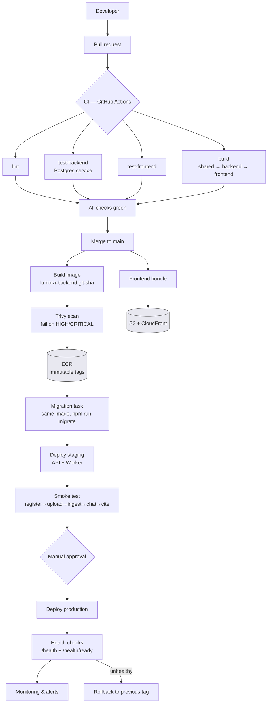

# 09 — DevOps, CI/CD, Containerization, Deployment

**STATUS: planning complete; nothing implemented.**

No Dockerfile, no CI workflow, no registry, no Kubernetes manifest, no
Terraform, and no deployment of any kind exists in this repository. This
document is the plan for building them, derived from what the code actually
does. It is the delivery counterpart to
[08-production-architecture.md](08-production-architecture.md), which decides
where data lives.

> **Three documents named in the brief do not exist.** There is no
> `docs/01-architecture.md`, `docs/02-technical.md`, or `docs/05-testing.md`.
> The actual set is `01-design-system`, `02-frontend`, `03-backend`,
> `04-data-and-api`, `05-rag-and-chat`, `06-roadmap`, plus `07`–`09`. Testing
> conventions live inside `03-backend.md` and `06-roadmap.md` §3, not in a
> document of their own.

---

## 1. Current state — verified, not assumed

### EXISTS NOW

| Thing | Reality |
|---|---|
| Frontend start | `npm run dev --workspace @lumora/frontend` → Vite on 5173 (5273 via `.claude/launch.json`) |
| Backend start | `tsx watch src/server.ts` on :4000 |
| Worker start | **In-process by default** (`WORKER_ENABLED=true`); `npm run worker` runs it standalone |
| PostgreSQL | `docker compose up postgres` → `lumora-pg`, volume `lumora-postgres-data` |
| Chroma | `docker compose up chroma` → `lumora-chroma`, volume `lumora-chroma-data` |
| Docker usage | **Dependencies only.** The compose header states the app is deliberately excluded, citing [06-roadmap.md](06-roadmap.md) §5 |
| Health probes | **Both exist** — `GET /health` (liveness, no DB check by design) and `GET /health/ready` (readiness, checks the database) |
| Graceful shutdown | **Production-grade already**: SIGTERM+SIGINT, a re-entry guard, an `unref()`ed timeout, and the worker draining *after* the HTTP server closes |
| Migrations | `npm run migrate` (`up`) / `migrate:status`; `NNNN_name.sql`, numeric order, **each in its own transaction** |
| Migrations in build | `scripts/copy-assets.mjs` copies `src/db/migrations` → `dist/db/migrations`, so **migrations ship inside the built artifact** |
| Reindex | `npm run reindex` — rebuilds vectors from Postgres |
| Node | `engines.node >= 22`; developed on v22.23.1, npm 10.9.8 |
| Package manager | npm workspaces (`shared`, `backend`, `frontend`). No `packageManager` field |
| Release process | **None.** Code runs from a working tree |

### NOT IMPLEMENTED

Dockerfile · `.dockerignore` · CI · CD · GitHub Actions · Kubernetes · Helm ·
Terraform/IaC · deploy script · staging · production · monitoring · centralized
logging · container registry · branch protection.

### PLANNED (elsewhere)

Managed Postgres, S3, pgvector, ECS Fargate, secrets manager — all
[08-production-architecture.md](08-production-architecture.md). Knowledge Base
— [07](07-knowledge-base.md).

### 1.1 Repository state

One unpushed commit (`a791dc5`) and **22 uncommitted files** — the mobile
navigation work. **CI must not be built on top of an uncommitted tree**: the
first workflow run should reflect a known commit. Landing that branch is a
prerequisite, not part of this plan.

### 1.2 Two facts that shape everything below

**Fact 1 — CI needs only PostgreSQL.** `tests/setup/test-env.ts` forces
`EMBEDDING_PROVIDER=fake`, `VECTOR_STORE=fake`, `LLM_PROVIDER=fake`, and
`chroma.store.test.ts` guards its live suite with
`describe.skipIf(!reachable)` (with a complementary `skipIf(reachable)` block
for the absent case). So:

- **No Chroma service is required in CI.**
- **No Gemini API key is required in CI.**
- A production secret never needs to enter the CI environment at all.

That is unusually clean, and it is a deliberate property of the test design
rather than luck. It makes CI cheap, fast, and safe.

**Fact 2 — there are two lockfiles.** Root `package-lock.json` (397 KB, the
workspace lock) and a vestigial `frontend/package-lock.json` (207 KB). npm
workspaces installs from the root lock only. CI must cache and install from the
root; a cache key built from the wrong lockfile silently restores a stale tree.
Deleting the frontend lock is a one-line cleanup that belongs in phase D1.

---

## 2. Target delivery architecture



Stateful services — PostgreSQL, S3, pgvector — sit outside this pipeline and
are managed, per [08](08-production-architecture.md) §6–7.

---

## 3. CI pipeline

Six jobs. The dependency graph is shallow because most work is independent.

| Job | Needs | Runs |
|---|---|---|
| `lint` | — | `npm run lint` both workspaces |
| `test-backend` | — | **Postgres service container**; `npm run test --workspace @lumora/backend` |
| `test-frontend` | — | `npm run test --workspace @lumora/frontend` |
| `build` | — | `shared` → `backend` (`tsc -b` + copy-assets) → `frontend` (`vite build`) |
| `docker` | `build` | Image build validation; push **only on `main`** |
| `security` | `docker` | Trivy image scan + `npm audit --omit=dev` |

`lint`, `test-backend`, `test-frontend`, and `build` run **in parallel**.
Typecheck is not a separate job: `tsc -b` inside `build` and
`tsc -p tsconfig.test.json --noEmit` inside the test scripts already cover it,
and a third invocation of the compiler buys nothing.

### 3.1 Concrete requirements

| Concern | Decision |
|---|---|
| Node | 22.x, pinned to the minor in CI; `engines` says `>=22` |
| Install | `npm ci` from the **root** lockfile — never `npm install` in CI |
| Cache | `actions/setup-node` npm cache keyed on `package-lock.json` (root only) |
| Test DB | Postgres 17 service container. `TEST_DATABASE_URL` must end in `_test` — the suite refuses otherwise, and `global-setup.ts` creates the database and runs migrations itself |
| Chroma | **Not needed.** The live suite skips cleanly |
| Gemini | **Not needed, and must not be provided.** Tests force `LLM_PROVIDER=fake` |
| Secrets in CI | Only `GITHUB_TOKEN` and registry/deploy credentials. **No Gemini key, no production `DATABASE_URL`** |
| Integration runtime | `pool: 'forks'`, `singleFork: true` — serial by design, `testTimeout: 20_000`. Budget ~3–5 min |
| Timeouts | 10 min per job, 20 min for the workflow — a hung job should fail, not idle |
| Failure | Fail fast per job; do not `continue-on-error` on anything that gates merge |

### 3.2 What must never run in CI

The real-Gemini end-to-end verification, and the browser verification against a
live Gemini key. Those are **release-gate activities against staging**, not
per-PR checks: they cost money per run, they depend on a third-party's
availability (Gemini 503'd three times across two working sessions), and a
flaky external dependency in a required check trains people to re-run CI until
it passes, which destroys the signal.

---

## 4. Pull request policy

`main` protected. No direct pushes, including for the repository owner —
the value of the rule is that it applies when someone is in a hurry.

- Required checks: `lint`, `test-backend`, `test-frontend`, `build`, `security`.
- Branches from `main`, merged by **squash** — the repo already uses
  conventional commits and small single-purpose commits, and squash keeps
  `main` one-commit-per-change so a revert is one revert.
- Require the branch to be up to date before merging.
- Approvals: 1 where a reviewer exists; on a solo project, required *checks*
  are the real gate and self-approval is honest rather than theatre.
- Deploys to production come only from `main`, only via the pipeline, and only
  behind the approval gate (§7).

---

## 5. Container strategy

### 5.1 Two artifacts, not three

| Component | Container? | Why |
|---|---|---|
| Frontend | **No** | Static bundle → S3 + CloudFront ([08](08-production-architecture.md) §7). An nginx container would add an image to build, patch, and scan in order to serve files a CDN serves better and cheaper |
| API | **Yes** — `lumora-backend:<sha>` | |
| Worker | **Yes — the same image**, different command | |

**One image for API and worker.** They share the entire dependency tree and
codebase and differ only in entrypoint (`npm run start` vs
`npm run start:worker`). Two images would double build time, registry storage,
and scan surface to express a one-word difference — and would introduce the
possibility of API and worker running different code, which is a genuinely bad
failure mode for a queue where one side writes rows the other reads.

**If the frontend must be containerized** (a platform that only accepts
containers), the shape is a multi-stage build ending in `nginx:alpine` serving
`dist/` with SPA fallback. Recommended only under that constraint.

### 5.2 Backend image specification

| Aspect | Decision |
|---|---|
| Base | `node:22-alpine` for build and runtime. Alpine is chosen for size; **`argon2` and `pdfjs-dist` must be verified against musl during D2** — argon2 ships prebuilds and this is the single most likely image-build surprise. Fallback: `node:22-slim` (Debian) |
| Stages | **build** — `npm ci` (full deps), `npm run build` for `shared` → `backend`. **runtime** — `npm ci --omit=dev`, copy `dist/` |
| Runtime cmd | API `node dist/server.js` · Worker `node dist/worker.js` (the `start`/`start:worker` scripts) |
| Migrations | Already inside the image via `copy-assets.mjs` — the migration task reuses this image |
| Port | 4000. `HOST=0.0.0.0` in-container — the `.env.example` warns that the 127.0.0.1 default "publishes to nothing" in a container |
| User | **Non-root.** Use the image's `node` user |
| Filesystem | **Read-only root filesystem.** Nothing is written to disk once S3 replaces `STORAGE_LOCAL_ROOT`; a `tmpfs` for `/tmp` covers multer's spooling |
| Signals | Node is PID 1 and **already handles SIGTERM/SIGINT correctly**, so no `tini`. `stopTimeout` must exceed the shutdown drain |
| Healthcheck | Orchestrator-level against `/health`; container `HEALTHCHECK` is redundant under ECS |
| Never in the image | `.env`, secrets, `uploads/`, test fixtures, `node_modules` from the host, `.git`, docs |
| `.dockerignore` | `node_modules`, `dist`, `.git`, `.env*`, `uploads`, `coverage`, `docs`, `*.md`, `.claude` — **required**, or the build context ships the host's `node_modules` |
| Size goal | < 400 MB. `pdfjs-dist` is large; this is a target to verify, not a measurement |
| Cache | Copy `package*.json` and install before copying source, so a source edit does not re-resolve dependencies |

### 5.3 Environment

Runtime configuration is entirely environment variables validated by Zod at
boot (`config/env.ts`), which refuses to start on a missing or malformed value
and names it. That is exactly the behavior you want in a container: a
misconfigured task dies immediately and visibly instead of failing on the first
user request.

**The API container is stateless** and must stay so: no uploads, no database
files, no vector data, no secrets baked in.

---

## 6. Worker deployment

Separate ECS service, same image, `WORKER_ENABLED=false` on the API.
**No code change is required** — `server.ts` states nothing in the worker
depends on co-location.

| Setting | Value | Confidence |
|---|---|---|
| `WORKER_CONCURRENCY` | 2 | **Known default** — chosen because parsing is memory-bound |
| `WORKER_LEASE_MS` | 60 000 | Known default |
| `WORKER_HEARTBEAT_INTERVAL_MS` | 15 000 | Known default; schema rejects values not well under the lease |
| `WORKER_REAPER_INTERVAL_MS` | 30 000 | Known default |
| Memory | **2 GB** | **Proposed** — a 25 MB PDF holds page tree, fonts, and text at once. To be benchmarked |
| CPU | 0.5 vCPU | Proposed |
| Replicas | 1 at launch | `SKIP LOCKED` makes N safe whenever wanted |
| Stop timeout | ≥ lease duration | So a job finishes rather than being reaped |

**Worker scaling is the one axis that already works.** `FOR UPDATE SKIP LOCKED`
with leases, heartbeats, and an idempotent reaper is precisely the design that
makes concurrent claiming correct. Autoscale on queue depth
(`jobs` where status is pending) if it ever matters — not on CPU.

Failed jobs retain their error code; the reaper reclaims leases from dead
workers within `WORKER_LEASE_MS`. A deploy that kills a worker mid-document
loses at most one lease interval, and the document is re-claimed rather than
lost.

---

## 7. Local development

**Recommendation: keep `docker compose` for dependencies only. Do not
containerize the app for local development, and do not run Kubernetes locally.**

| | Infra-only (current) | Full compose (app included) |
|---|---|---|
| Onboarding | `docker compose up` + `npm run dev` | One command |
| Hot reload | Native `tsx watch` / Vite HMR | Bind mounts, slower, flakier on macOS |
| Debugging | Attach directly | Through a container boundary |
| RAM | **~2 GB Docker** (deliberately capped on an 8 GB machine) | Materially more |
| Prod parity | Lower | Higher |

The parity gain is real but small — the image is validated in CI on every
change, which is where parity failures should surface. The RAM cost is not
small on the actual development machine. Keep the current split.

**Local Kubernetes (kind/minikube) is explicitly not recommended.** Both are
already present but stopped on this machine, and running a control plane inside
a 2 GB Docker allocation to develop a two-service application is a poor trade.

---

## 8. Registry

**Recommendation: Amazon ECR**, consistent with the AWS target in
[08](08-production-architecture.md) — ECS pulls via the task execution role with
no pull secret to manage, and image scanning is built in. **GHCR** is the right
choice if the platform decision (§O-1 in 08) moves off AWS, since CI is GitHub
and `GITHUB_TOKEN` authenticates for free.

| Policy | Decision |
|---|---|
| Repository | `lumora-backend` (one — API and worker share it) |
| Primary tag | **`<git-sha>`, immutable.** Tag immutability enabled at the repository level |
| Secondary | `v<semver>` on releases; `staging`/`production` as *moving pointers only*, never deploy targets |
| **`latest`** | **Not used for deployment, ever.** It makes "what is running?" unanswerable and makes rollback ambiguous |
| Retention | Keep last 30 images + anything tagged `v*`; expire untagged after 7 days |
| Scanning | On push; block promotion on HIGH/CRITICAL with a fix available |

Deployments reference `lumora-backend:<git-sha>`. That single rule is what makes
rollback a one-line change and makes an incident timeline reconstructible.

---

## 9. Kubernetes — the decision

**Recommendation: no Kubernetes. Use ECS Fargate.**

| | ECS Fargate | Managed K8s (EKS) | Self-managed K8s |
|---|---|---|---|
| Control-plane cost | $0 | **~$73/mo** before any workload | Instance cost + your time |
| Operational burden | Low | Medium–high | High |
| Fit for 2 services | Good | Oversized | Absurd |
| Deployment speed | Minutes | Minutes | Minutes |
| Learning value | Moderate | **High** | High |

The deciding argument is not cost, it is that **Lumora cannot use what
Kubernetes is for.** The API is pinned to **one replica** by R7 — process-local
rate limiting and a process-local abort registry (§11). Horizontal pod
autoscaling, pod disruption budgets, and rolling multi-replica updates are the
features you buy Kubernetes for, and all three are unusable until those two
blockers are fixed. Paying a control plane and a cluster's operational surface
for a two-service, one-replica application is cost without benefit.

**Revisit when** any of: R7 is fixed and the API genuinely runs 3+ replicas; the
service count exceeds ~5; multi-region; or a team exists that already operates
Kubernetes. If Lumora is partly a **portfolio** artifact and Kubernetes
experience is itself the goal, that is a legitimate reason — but it is a
learning objective, not an architectural requirement, and this document should
not pretend otherwise. **Open question O-1.**

**If Kubernetes is adopted anyway**, the shape is: namespace per environment ·
`Deployment` for API (1 replica) and worker (1–N) · `Service` + `Ingress` (ALB
controller) for the API only · `ConfigMap` for non-secret env · `Secret`
sourced from an external secrets operator, never checked in · liveness
`/health`, readiness `/health/ready`, startup probe with a generous failure
threshold for migration waits · requests/limits per §12 · `RollingUpdate`
`maxUnavailable: 0` · **no PersistentVolumes at all** — Postgres, S3, and
pgvector stay managed and outside the cluster. **Helm only if a second
environment exists**; for one environment, plain manifests with `kustomize`
overlays are less machinery for the same result.

---

## 10. Infrastructure as code

**Recommendation: Terraform, but at phase D5 — not first.**

IaC pays for itself at the *second* environment. For a single hand-built
production environment, a documented provisioning runbook is honest and faster;
the risk is drift, which matters once staging must match production. Since
staging is planned (§11), Terraform is worth doing — just not before there is
something to reproduce.

Proposed layout (**do not create yet**):

```
infra/terraform/
  environments/{staging,prod}/     # thin: backend config + module wiring
  modules/{network,database,storage,compute,registry,monitoring}/
```

State in S3 with **versioning enabled** and DynamoDB (or S3 native) locking.
One state file per environment — a shared state file means a staging apply can
damage production. `plan` on PR as a required check, `apply` gated on manual
approval from `main`. **No secrets in Terraform source or variables** — create
secret *containers* in Terraform and populate values out of band, so the state
file never holds a plaintext secret. Scheduled `plan` for drift detection.

---

## 11. Environments and scaling blockers

### 11.1 Environments

| | Development | Staging | Production |
|---|---|---|---|
| Database | Docker `lumora-pg` | Own instance | **Own instance** |
| Objects | Local disk | Own bucket | **Own bucket** |
| Vectors | Docker Chroma | Own store | **Own store** |
| Secrets | Local `.env` | Own set | **Own set** |
| Gemini key | Dev key | Dev key | **Separate key** |

Nothing is shared. Not a bucket, not a database, not a secret, not a key.

### 11.2 Horizontal scaling

| Component | Now | Blocker |
|---|---|---|
| **API** | ❌ **1 replica only** | **Process-local rate limiting** — N replicas multiply every limit by N, silently weakening auth protection. **Process-local abort registry** — stop-generation fails unless the request lands on the streaming instance |
| **Worker** | ✅ **Scales today** | None — `SKIP LOCKED` is built for it |
| PostgreSQL | ✅ Vertical; read replicas later | `DATABASE_POOL_MAX` is per-process — total connections = pool × instances |
| pgvector | ✅ With Postgres | — |
| S3 | ✅ Effectively unlimited | — |
| Frontend | ✅ CDN | — |

To lift the API to N>1, in order: **(1)** implement a shared `RateLimitStore` —
the interface already exists and a Postgres table suffices, **no Redis needed**;
**(2)** solve abort routing via sticky sessions or a shared signal (a
`LISTEN/NOTIFY` channel is sufficient and adds no service). Neither is needed at
launch, and neither should be built before traffic demands it.

---

## 12. Resource sizing

| Component | Proposal | Confidence |
|---|---|---|
| API | 0.5 vCPU / 1 GB | **Estimated** |
| Worker | 0.5 vCPU / **2 GB** | **Estimated** — driven by the 25 MB PDF ceiling and `WORKER_CONCURRENCY=2`. **To be benchmarked first** |
| PostgreSQL | db.t4g.micro/small, 20 GB gp3 | Estimated |
| pgvector | Inside Postgres | — |
| Frontend | CDN | **Known** — built bundle is ~330 KB vendor + ~213 KB markdown chunk, gzipped well below |
| `DATABASE_POOL_MAX` | 10 per process | **Known default**; with API + worker that is 20 connections against a default 100 |

**KNOWN**: bundle sizes, worker defaults, pool size, Node version, the 25 MB /
5-file upload limits. **ESTIMATED**: every CPU and memory figure.
**TO BE BENCHMARKED**: peak worker RSS during a 25 MB PDF parse at concurrency
2; API memory under concurrent SSE streams. Neither has been measured, and this
document does not pretend otherwise.

---

## 13. Deployment, migrations, rollback

### 13.1 Order: migrate before deploy

Run migrations as a **separate task using the image about to be deployed**
(migrations ship in it) — before the new application version starts.

This requires **expand/contract** discipline, because during the window between
migration and rollout the *old* code runs against the *new* schema:

1. **Expand** — add nullable columns/tables. Old code ignores them. Deploy.
2. **Migrate data** — backfill. Deploy code that writes both and reads new.
3. **Contract** — drop the old column, in a **later** release.

The Knowledge Base migration in [07](07-knowledge-base.md) is a clean expand:
two new tables and one nullable column, invisible to running code. A contract
step is where an incident happens, and it must never be in the same release as
the code that stops using the column.

### 13.2 Zero downtime

**Not required at launch — state this plainly rather than engineering around
it.** With one API replica, a rolling deploy either briefly runs two instances
(acceptable: rate limits are momentarily doubled for ~60 s) or accepts a gap of
seconds. Either is fine for early traffic. The building blocks already exist —
graceful shutdown drains connections, the worker finishes its lease, and jobs
are recoverable — so this becomes free once the API can run N>1.

A migration that requires a table lock is a genuine maintenance window. Announce
it; do not pretend it is invisible.

### 13.3 Rollback

| Failure | Action | Time |
|---|---|---|
| Bad API image | Redeploy previous `<git-sha>` | ~5 min |
| Bad frontend | Re-publish previous bundle; invalidate CDN | ~5 min |
| Bad worker | Redeploy previous tag; leases reclaim in-flight jobs | ~5 min |
| Bad configuration | Revert the value; restart the task | ~2 min |
| **Bad migration** | **See below** | **Hours** |

**Container rollback is cheap because images are immutable and stateless — a
previous tag is a complete, exact previous state. Database rollback is not,
because a migration has already transformed data that the previous code may no
longer understand, and any writes since the migration exist only in the new
shape.** Reverting the schema can therefore destroy data written after it.

Consequences: an **expand** migration is trivially rollback-safe (deploy the
old image; the new column is ignored). A **contract** migration is not — the
dropped column's data is gone, and recovery means PITR to just before the
migration, which discards every write since. That is why contract steps ship
alone, after the code that stopped using the column has been running for a
release, and **never without a verified fresh backup taken immediately before**.

---

## 14. Secrets

| Store | Role |
|---|---|
| **AWS Secrets Manager** | Runtime application secrets — `DATABASE_URL`, `JWT_ACCESS_SECRET`, `GEMINI_API_KEY`, `SMTP_PASSWORD`. Rotation support is the reason to prefer it over SSM for these |
| **SSM Parameter Store** | Non-secret config that still varies per environment (`CORS_ORIGINS`, `APP_URL`, `LOG_LEVEL`). Free tier, no rotation needed |
| **GitHub Actions Secrets** | **Deployment credentials only** — ideally none, using OIDC to assume an AWS role instead of storing long-lived keys |
| **Kubernetes Secrets** | Not applicable (no Kubernetes). If adopted: base64, **not encryption** — must be backed by an external secrets operator |
| **IAM task role** | S3 access. **Prefer this over any static credential** |

Never in: Git · a Docker image layer · the frontend bundle · a ConfigMap ·
Terraform source or state · CI logs. Extend the existing pino redaction list to
any new secret-bearing field.

---

## 15. Observability

**Log** (structured JSON, request-id already plumbed): request id · job id ·
document id · user id · error code · latency · finish reason.
**Never log**: passwords, password hashes, JWTs, refresh tokens (even hashed —
they are credentials), the Gemini key, document or chunk content, or query text.
The last is subtle and already respected: `retrieval.service.ts` deliberately
logs query *length and term count* rather than the query, because a user's
question about their own documents is private content.

**Metrics**: 5xx rate · p95/p99 latency · SSE stream duration and abort rate ·
job queue depth · job failure rate by error code · **Gemini failure and 503
rate** · vector query failures · database connections and storage · worker
memory (against the parse ceiling) · auth failure and lockout rate.

**Stack**: CloudWatch Logs (pino JSON needs no agent) + CloudWatch alarms +
Sentry for errors + an external uptime check on `/health`. Distributed tracing
is deferred — the request-id plumbing means it can be added without rework.

### 15.1 Alerts — all thresholds are **initial proposals**

| Alert | Proposed trigger |
|---|---|
| API unavailable | 2 consecutive uptime failures |
| High 5xx | >2% over 5 min |
| High latency | p95 > 3 s over 10 min (excluding SSE) |
| Worker stopped | No job claimed in 15 min while queue depth > 0 |
| Queue growing | Depth > 20 and rising for 15 min |
| Repeated job failures | >5 failures in 10 min |
| DB storage | > 80% |
| DB connections | > 80% of max |
| **Gemini failures** | **>10% over 15 min** — observed 3× in two sessions; this one will fire |
| S3 errors | Any 5xx sustained 5 min |
| Deploy failure | Any |
| Cert expiry | < 21 days |
| Auth anomaly | Failed logins > 5× baseline (credential stuffing) |

Every number above is a starting point to be tuned against real traffic. Alerts
that fire spuriously get muted, and muted alerts are worse than absent ones.

---

## 16. Security and supply chain

**Meaningful risk reduction**: `npm ci` from a committed lockfile (build
reproducibility) · Dependabot or Renovate on a **weekly, grouped** schedule —
daily individual PRs are ignored, which is worse than none · Trivy image
scanning gating promotion on HIGH/CRITICAL with fixes available · non-root,
read-only-root containers · minimal base image · **GitHub secret scanning with
push protection** — the highest-value control here, because the most likely real
incident is a `.env` committed by accident · branch protection · least-privilege
IAM and OIDC instead of static keys.

**Security theatre to avoid for now**: image signing/attestation (Cosign, SLSA)
— valuable for a public supply chain, near-zero marginal benefit for a
single-maintainer private deployment · a generated SBOM nobody consumes · fully
pinned transitive digests, which mostly produces noise and stale dependencies.
Revisit when there are external consumers or a compliance requirement.

---

## 17. Disaster recovery

Extends [08](08-production-architecture.md) §11 to the delivery layer.

| Layer | RPO | RTO | Recovery |
|---|---|---|---|
| PostgreSQL | ~5 min | 30–60 min | PITR restore |
| S3 | 0 | 0 | Versioning; cross-region optional |
| Vector index | n/a | Minutes–hours | **Rebuild** — `npm run reindex` |
| API / Worker | 0 | ~5 min | Redeploy a known tag |
| Frontend | 0 | ~5 min | Re-publish bundle |
| **CI/CD itself** | 0 | Hours | GitHub-hosted. **The repo is the recovery artifact**; images in ECR mean production can be redeployed even if CI is down |

**Restore drill — schedule before launch, then quarterly**: restore the latest
PITR snapshot into a scratch instance, point a staging API at it, register and
log in, confirm row counts against production, verify one document's chunks
retrieve with correct citations, then destroy the scratch instance. Record the
wall-clock time — that number *is* your real RTO, and it is usually worse than
the estimate.

---

## 18. DevOps-specific cost

Delivery-layer only. Runtime infrastructure is in
[08](08-production-architecture.md) §13 and is **not repeated here**.

| Item | Monthly |
|---|---|
| GitHub Actions | **$0** — free tier for private repos covers this pipeline comfortably |
| ECR storage | $1–3 (30 images × ~400 MB × $0.10/GB) |
| Terraform state (S3 + lock) | < $1 |
| Sentry | $0–26 (free tier likely sufficient) |
| CloudWatch logs + alarms | $3–8 |
| Uptime monitoring | $0–10 |
| **Total delivery layer** | **≈ $5–45/month** |
| *If EKS were chosen* | *+$73 control plane before workloads* |

Combined with [08](08-production-architecture.md)'s $56–88 fixed: **≈ $65–130/month**
all-in for a small production deployment. Approximate; verify current pricing.

---

## 19. Implementation phases

| # | Objective | Touches | Depends | Validation |
|---|---|---|---|---|
| **D0** | **Land the uncommitted branch** | mobile UX work | — | `main` green; CI has a real commit |
| **D1** | **CI foundation** | `.github/workflows/ci.yml`; delete `frontend/package-lock.json` | D0 | All six jobs green on a PR |
| **D2** | Production images | `backend/Dockerfile`, `.dockerignore` | D1 | Image builds; container starts; **verify argon2/pdfjs on musl** |
| **D3** | Branch protection | Repo settings | D1 | Direct push to `main` rejected |
| **D4** | Registry + push | CI workflow | D2 | Immutable `<sha>` tags; scan clean |
| **D5** | IaC | `infra/terraform/**` | D4 | `plan` clean; staging provisioned |
| **D6** | Staging | Terraform + CD workflow | D5 | Smoke test passes end-to-end |
| **D7** | CD with approval | Deploy workflow | D6 | Staging → approval → production |
| **D8** | Production cutover | — | D7 | [08](08-production-architecture.md) §15 checklist |
| **D9** | Observability | Alarms, Sentry, uptime | D8 | Each alert fires in a drill |
| **D10** | Security hardening | Dependabot, secret scanning, Trivy gate | D4 | Scan blocks a seeded CVE |
| **D11** | **Backup/restore drill** | Runbook | D8 | Measured RTO recorded |
| **D12** | Kubernetes | — | **Only if O-1 justifies it** | — |

**Rollback per phase**: D1–D4 are additive and revert by deleting files. D5+
touch live infrastructure — `terraform plan` before every apply, and never
apply to production outside the pipeline.

---

## 20. Decision register

| Decision | Recommendation | Reason | Alternative | Revisit when |
|---|---|---|---|---|
| CI platform | **GitHub Actions** | Code is on GitHub; free tier covers it | GitLab CI, CircleCI | Moving off GitHub |
| Containerize app | **Yes, backend only** | Reproducible deploys | Deploy from source | — |
| Frontend container | **No — CDN static** | No runtime; cheaper, faster | nginx image | Platform demands a container |
| API/worker images | **One image, two commands** | Identical code; halves build and scan | Two images | Dependencies genuinely diverge |
| Local dev | **Compose for infra only** | RAM; hot reload; CI covers parity | Full compose | Onboarding pain outweighs it |
| Registry | **ECR** | Native ECS auth; scanning built in | GHCR | Platform moves off AWS |
| Platform | **ECS Fargate** | Two services, one API replica | Render/Fly (cheaper) | Cost or complexity shifts |
| **Kubernetes** | **No** | Its core features are unusable under R7 | EKS | R7 fixed **and** 3+ replicas, or learning is the goal |
| Helm | **No** | No Kubernetes | kustomize | With Kubernetes |
| Terraform | **Yes, at D5** | Pays off at the 2nd environment | Documented runbook | Staging exists |
| Managed Postgres | **Yes (RDS)** | Backups, PITR, patching | Self-managed | — |
| S3 | **Yes** | Durability; ephemeral containers | R2 (cheaper egress) | Off AWS |
| pgvector | **Yes** | Removes a stateful service; PITR-covered | Hosted Chroma | Vector scale demands specialization |
| Worker | **Separate service** | Memory profile; no code change needed | In-process | — |
| Staging | **Yes** | Migrations and smoke tests need somewhere real | Prod-only | — |
| Deploy strategy | **Immutable `<sha>`, approval-gated** | Unambiguous rollback | Rolling `latest` | Never |
| Secrets | **Secrets Manager + OIDC** | No long-lived credentials | Env vars in the platform | — |
| Monitoring | **CloudWatch + Sentry + uptime** | Minimum that answers "is it broken" | Datadog/Grafana | Costs justify it |
| API replicas | **1 until R7 is fixed** | Rate limiting and abort are process-local | Shared store first | Traffic demands N>1 |

---

## 21. Open questions

Only genuine ones.

1. **O-1 — Is Kubernetes a learning objective?** The architecture says no. If
   Lumora is partly a portfolio piece and demonstrating Kubernetes is itself the
   point, that changes the answer — and should be recorded as such rather than
   justified architecturally. **This is the single biggest fork in this document.**
2. **O-2 — AWS, or Render/Fly + Neon + R2?** Inherited from
   [08](08-production-architecture.md) O-1. Determines the registry and IaC
   choices above.
3. **O-3 — Is a staging environment funded?** It roughly doubles fixed
   infrastructure cost. Skipping it is defensible early but must be a decision,
   not an omission.
4. **O-4 — Expected launch traffic?** Every sizing figure in §12 is an estimate
   pending this.
5. **O-5 — Solo maintainer, or a team?** Determines whether PR approval is a
   real gate or ceremony.

Not open, and settled by the repository: CI needs no Gemini key and no Chroma
(§1.2) · the worker splits with no code change · migrations ship in the image ·
liveness and readiness probes already exist · R7 is the binding scaling
constraint.
